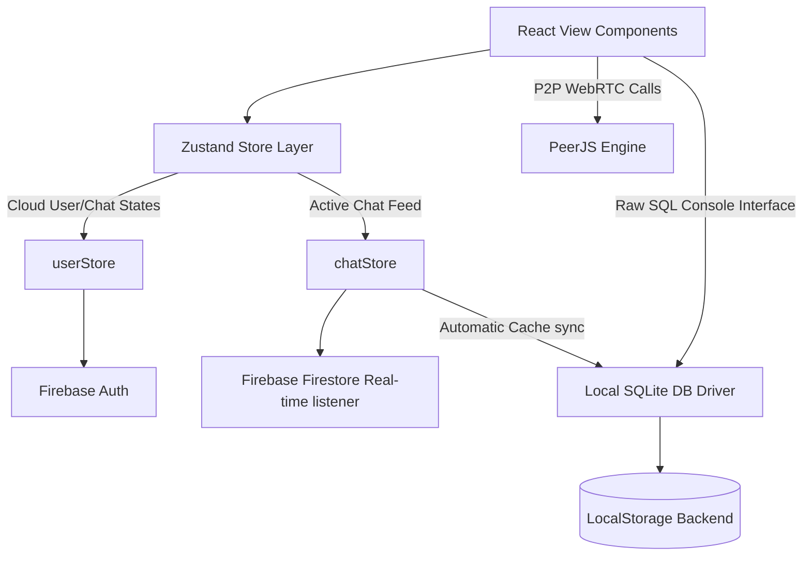
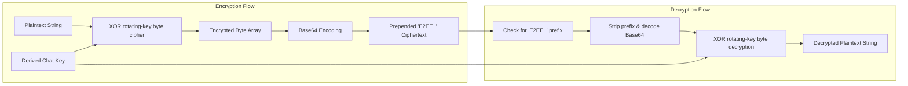
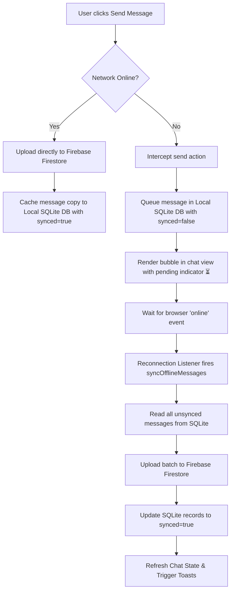
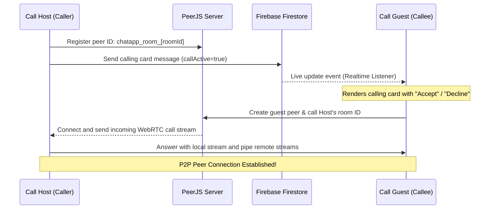

# 💬 **ChatApp: Premium Offline-First Web Client** 🚀  
**A futuristic, responsive, glassmorphic real-time chat application with E2EE, WebRTC audio/video calls, offline-first SQLite cache storage, and AI game elements. Built with React, Zustand, and Firebase.**

---

## 🌟 **Executive Overview**
ChatApp is designed to deliver a high-fidelity, desktop-class messaging experience on both modern desktop viewports and compact mobile viewports (e.g. OnePlus Nord 3 5G, viewports down to 320px). It supports two principal operation environments:
- **Cloud Mode**: Real-time Firebase-backed synchronization with Firestore databases, Auth, and Storage.
- **Local Mode (Guest)**: Zero-backend, offline-first local database architecture utilizing an emulated SQLite database driver.

---

## 📐 **Architecture & Topology**
The client application architecture relies on dynamic Zustand stores for global state management and isolates UI layouts into high-performance components. Below is the system component diagram:



### **System Layers**
1. **View Layer**: Built using React 18, Vite, and custom-styled glassmorphic CSS classes. Layouts adapt dynamically to screen heights using browser dynamic viewports (`100dvh`).
2. **State Store Layer**: Powered by Zustand. Manages user authentication state, current chats, unread indicators, and local/cloud mode settings.
3. **Local DB Driver**: Emulates a relational SQLite database inside the client. Runs queries against raw stringified arrays stored in `localStorage` acting as the relational disk blocks.
4. **Signaling/WebRTC Engine**: Enables peer-to-peer audio and video calls. Registers signaling nodes over PeerJS public hosts and manages RTCPeerConnection stream pipelines directly between client cameras and microphones.

---

## 🔒 **Security & End-to-End Encryption (E2EE)**

To protect conversation privacy, ChatApp uses a lightweight, client-side encryption wrapper around all text message payloads.



### **Cryptographic Mechanics (`encryption.js`)**
- **Key Derivation**: For any conversation, a unique encryption key is dynamically derived from the conversation's `chatId` combined with an app-wide static salt:
  $$\text{Key} = \text{chatId} + \text{"\_secure\_e2ee\_2026"}$$
- **XOR Rotating Byte Cipher**: Text payloads are encoded into byte streams using `TextEncoder` and XORed byte-by-byte with a rotating key byte array combined with the loop index:
  $$\text{CipherByte}[i] = \text{TextByte}[i] \oplus (\text{KeyByte}[i \bmod \text{KeyLength}] \oplus (i \bmod 256))$$
- **Serialization**: The resulting encrypted byte array is base64-encoded and prepended with a system-wide E2EE header marker `E2EE_`.
- **Handling Decryption**: When reading incoming messages or cached entries, payloads are checked for the `E2EE_` prefix. If present, the base64 ciphertext is decoded, run through the inverse XOR rotation, and decoded back into standard text using `TextDecoder`. Unencrypted legacy messages or media elements bypass decryption smoothly.

---

## 🗄️ **SQLite Emulator Relational Layer**

A core driver `localDb.js` emulates relational database execution. It parses incoming queries and executes SQL statements against collections inside LocalStorage.

### **Emulated Database Schema**

| Table Name | LocalStorage Key | Attributes / JSON Schema |
| :--- | :--- | :--- |
| **`users`** | `sqlite_users` | `id` (PK), `username`, `email`, `password`, `avatar`, `status`, `blocked` (Array) |
| **`chats`** | `sqlite_chats` | `id` (PK), `createdAt` (Timestamp), `messages` (Array of message objects) |
| **`userchats`** | `sqlite_userchats` | Dictionary indexed by `userId` containing lists of `{ chatId, lastMessage, receiverId, updatedAt, isSeen }` |
| **`stories`** | `sqlite_stories` | `id` (PK), `userId`, `username`, `userAvatar`, `content` (Text or media path), `type`, `createdAt`, `expiresAt` |

### **Query Execution**
The emulated database provides an interactive `query(sql, params)` execution route:
- **`SELECT`**: Matches targeted patterns to filter items by `id` or expires tags. Expired stories are auto-filtered out based on timestamp comparisons.
- **`INSERT`**: Appends records to the JSON tables and updates index records.
- **`UPDATE`**: Selects items and modifies fields (e.g., updating user status or appending messages into chat blocks).
- **`DELETE`**: Discards records by filtering them out from table lists.
- **Reactivity Event**: Upon performing any successful SQL modification, the database dispatches a custom browser event `"local-db-update"`. Reactive React modules catch this event and automatically refresh their local states.

---

## 📡 **Offline-First Synchronization State Machine**

ChatApp supports fully offline actions. When network connections drop, the application transitions to an offline queueing loop to preserve and sync data:



### **Detailed Sync Behavior**
1. **Offline Interception**: If `navigator.onLine` returns `false` during a chat send event, the client stops network uploads and directs the message payload directly to the SQLite local storage database.
2. **Local Queuing**: The message payload is appended to the local SQLite chat messages array with a metadata flag `synced: false`.
3. **Pending UI Rendering**: In the messages feed, messages flagged with `synced: false` are rendered with an explicit pending indicator (`⏳`).
4. **Reconnection Handler**: A global window listener monitors the `'online'` event. Upon network restoration:
   - The sync process pulls all messages with `synced: false` from the emulated SQLite driver.
   - It performs an upload batch to push these messages to Firebase Firestore.
   - It updates the SQLite entries to `synced: true`.
   - The pending indicator (`⏳`) disappears in real-time, and a success toast notification appears.

---

## 📡 **WebRTC P2P Call Signaling & Media Engine**

Real-time audio, video, and data communication is implemented using WebRTC, with PeerJS serving as the signaling wrapper. The engine supports 1-on-1 calls, full mesh multi-party group calls, screen sharing, and interactive data synchronization.



### **Advanced Calling Features & Optimizations**

1. **Full Mesh P2P Group Calls**
   - Supports multi-user layout structures using a star-signaling mesh topology.
   - When calling in a group chat, the initiator acts as the core signal node. Group members connect to the active call room and propagate connection configurations dynamically to construct client-to-client WebRTC peer meshes.

2. **Screen Sharing Integration**
   - Incorporates real-time desktop capture via `navigator.mediaDevices.getDisplayMedia`.
   - Replaces active camera tracks across all established peer connections dynamically using `RTCRtpSender.replaceTrack` without interrupting the session.

3. **In-Call Text Chat**
   - Features a sliding chat drawer within the active call interface.
   - Allows users to exchange text messages in real-time. Messages are also written back to the persistent database via a hoisted state handler.

4. **Status Syncing over WebRTC Data Channels**
   - Coordinates parallel `RTCDataChannel` connections to sync call control states in real-time.
   - Triggers dynamic UI overlays when a peer mutes (`🎙️❌`) or turns off their camera (replacing the video feed with their user avatar).

5. **Non-Blocking Picture-in-Picture (PiP) Mode**
   - Minimizes the active call interface into a floating, draggable, and resizable HUD docked at the bottom-right of the screen.
   - Enables users to navigate the app, browse chat lists, and type messages in the background while the call remains active.

6. **Mobile Autoplay & Camera Re-mounting Enhancements**
   - **Autoplay Overrides**: Handles mobile web browser media policies that block unmuted remote audio/video autoplay. Detects promise rejections and displays a click-to-enable overlay to satisfy user-gesture activation constraints.
   - **Persistent Video Mounts**: Solves the black screen bug on camera toggle by keeping `<video>` elements mounted in the DOM. Stream visibility is toggled via CSS `display` attributes, preserving the `srcObject` stream reference.
   - **Auto-Close Timer**: When a remote user disconnects, the app displays a disconnection toast, starts a 10-second countdown, and automatically cleans up call resources and closes the UI if no reconnection happens.

7. **Optimized Back-Navigation Reset**
   - Prevents the infinite loading spinner on mobile/slower viewports during back-button navigation by decoupling `isChatsLoaded` from standard chat state resets, ensuring clean transition pipelines.

### **Interactive Signaling Card Actions**
- **Hosting a Call**: Clicking the call icon generates a unique 5-character alphanumeric room ID and uploads a message bubble of type `call-invite` to Firestore with `callActive: true` and `roomId`. It registers a host node with the ID `chatapp_room_[roomId]` on the public PeerJS server.
- **Accepting a Call**: The receiver detects the card and clicks **Accept**. The client creates a guest node `chatapp_guest_[guestId]` and calls the host's peer room ID.
- **Decline/Cancel**: Updates the Firestore calling card message status to `declined` or `ended`, signaling the other peer to immediately close hardware camera streams and clean up listeners.

---

## 🤖 **AI Boredom Group & Breakout Game**

For users stuck in chat, the app introduces an interactive group chatbot named **Boredom Bot** (powered by Gemini AI):

- **Trigger Condition**: When an "AI Boredom Group" is created, Boredom Bot listens to all incoming messages in the chat room.
- **Sarcastic Roast Loop**: If the conversation becomes slow, repetitive, or boring (measured by message counts, keywords, or time delays), Boredom Bot injects sarcastic roasts or prompts the users to play a mini-game.
- **Breakers Game**: Renders an interactive, canvas-based block-breaking game inside the chat layout.
- **Escape Validation**: To exit the boredom group, the user must beat the Breakers Game. The score or achievement is verified by the Gemini API or client-side game logic before granting permission to leave the group.

---

## 🖥️ **Interactive SQL Console Usage**

Developers and administrators can access the console inside the client header to inspect table structures or run tests:

### **Common Debugging SQL Queries**
- **List All Users**:
  ```sql
  SELECT * FROM users
  ```
- **Inspect Cached Conversations**:
  ```sql
  SELECT * FROM chats
  ```
- **Inspect Unsynced Queue Items**:
  ```sql
  SELECT * FROM chats WHERE synced = false
  ```
- **Manually Create User Profile**:
  ```sql
  INSERT INTO users (id, username, email, avatar, status) VALUES ('dev_user', 'Developer Admin', 'admin@chatapp.net', './avatar2.png', 'Modifying local DB directly')
  ```
- **Reset Guest User Status**:
  ```sql
  UPDATE users SET status = 'Status updated!' WHERE id = 'guest_user'
  ```

---

## 🛠️ **Installation & Deployment**

### **1. Configure Environment variables**
Create a `.env` file in the root of the `Chat_App_React` directory:
```env
# Firebase Configuration
VITE_FIREBASE_API_KEY="your-api-key"
VITE_FIREBASE_AUTH_DOMAIN="your-auth-domain-url"
VITE_FIREBASE_PROJECT_ID="your-project-id"
VITE_FIREBASE_STORAGE_BUCKET="your-storage-bucket-url"
VITE_FIREBASE_MESSAGING_SENDER_ID="your-sender-id"
VITE_FIREBASE_APP_ID="your-app-id"

# Optional Gemini AI API Key (for Boredom Bot evaluation)
VITE_GEMINI_API_KEY="your-gemini-api-key"
```

### **2. Setup and Execution**
```bash
# Install package dependencies
npm install

# Start local Vite development server
npm run dev

# Compile optimized static bundle for production
npm run build

# Run local preview server of the production build
npm run preview
```

### **3. Production Deployment Security Rules**
For cloud production deployments, verify the following configurations are set:
- **CORS Allowed Origins**: Update Firebase console settings to restrict database reads to your production domain name.
- **Firestore Security Rules**:
  ```javascript
  rules_version = '2';
  service cloud.firestore {
    match /databases/{database}/documents {
      match /users/{userId} {
        allow read, write: if request.auth != null;
      }
      match /chats/{chatId} {
        allow read, write: if request.auth != null;
      }
      match /userchats/{userId} {
        allow read, write: if request.auth != null;
      }
      match /stories/{storyId} {
        allow read, write: if request.auth != null;
      }
    }
  }
  ```

---

### **Author**
* Sukrit Chopra

Let's connect the world, one chat at a time! ✨
